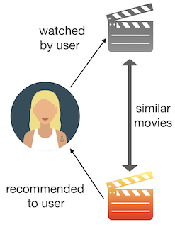
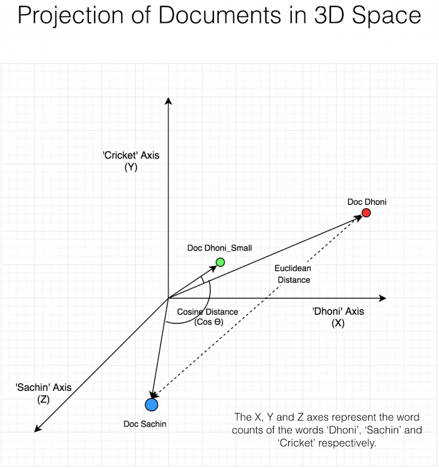
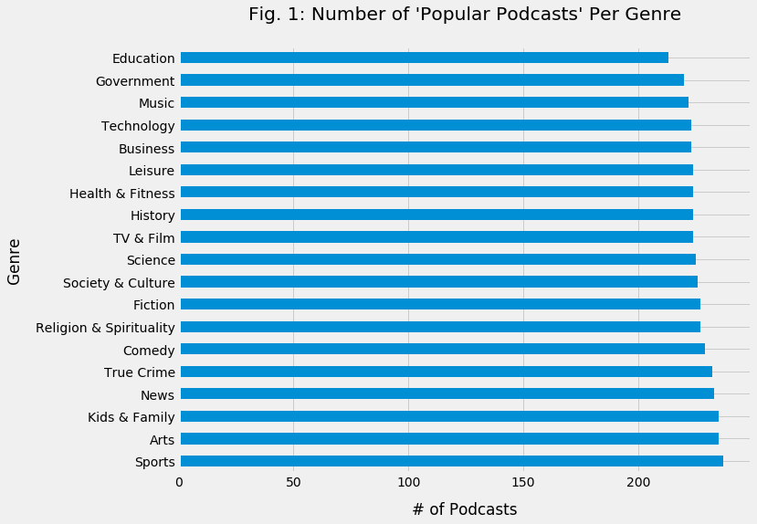
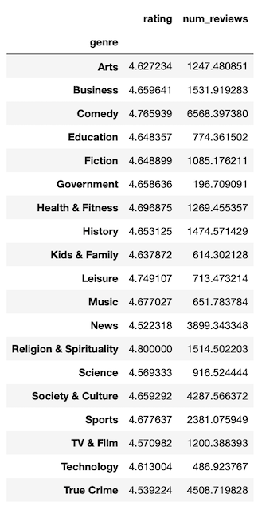
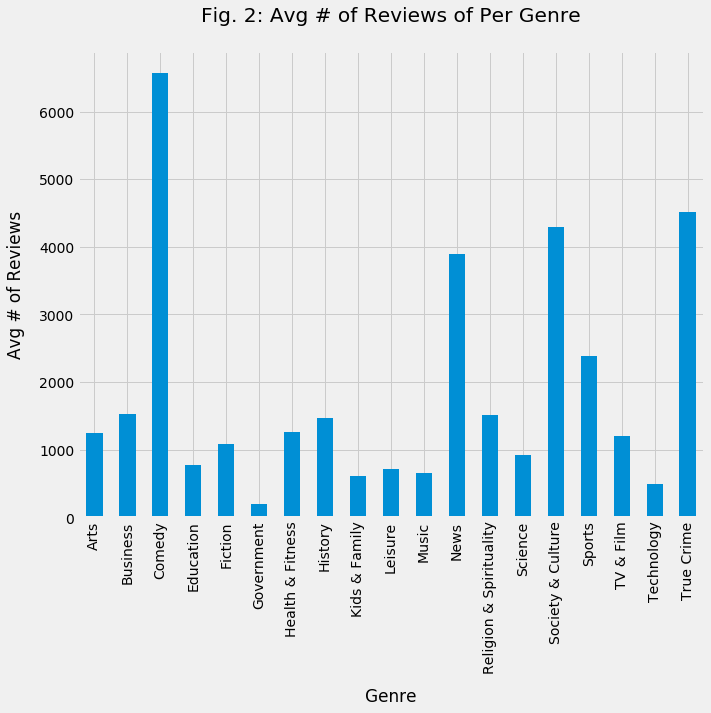
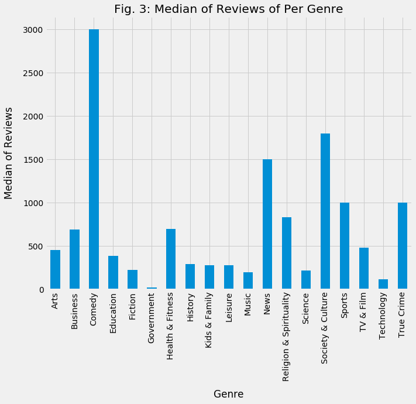
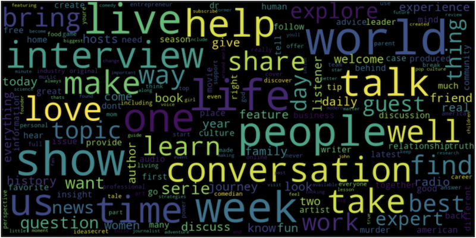
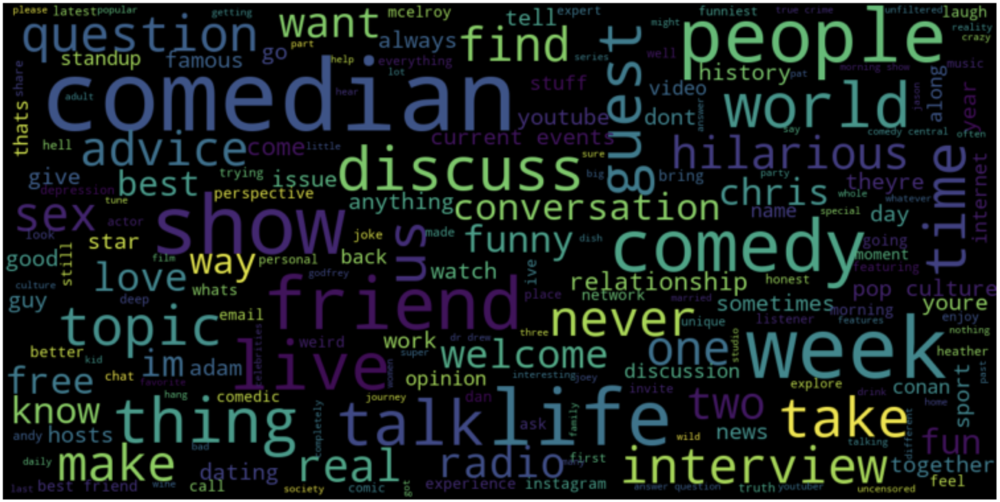
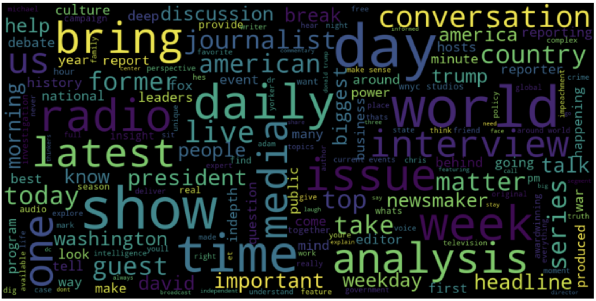

# Podcast Recommendation Engine
:microphone: Building a content-based podcast recommender system using NLP

## Overview
With the growth of podcasting in the past few years, it becomes increasingly difficult for users to discover new podcasts they may enjoy. Listeners may have a handful of regular podcasts they listen to and are usually reluctant or hesitant in listening to something new. Unlike with music or movies, users can't listen to the first 10 seconds or scrub through a preview to see if they like a particular podcast. Podcasts are usually long and topics per podcast vary greatly, which adds to the challenge of matching users to podcasts they might enjoy. Additionally, due to the sheer volume of podcasts and podcast episodes, it's near impossible for users to scour through them all to find the podcast they like.

However, we can potentially aggregate metadata about podcasts that a user does like and employ various NLP techniques to recommend new, similar podcasts that they may enjoy.

### Content-Based Recommendation Systems
Content-based recommendation systems is one main type of recommender systems that is used to provide recommendations to a user. This type of recommendation system takes in a user's information and preferences and picks items to recommend that are similar in content. With continually growing podcast database, a content-based recommendation engine could select a subset of podcasts (or even specific podcast episodes) and determine an order in which to display them to a users. Based on a user profile, this system could analyze podcast descriptions and identify podcasts that are similar to the user's preferences.

More information regarding content-based recommender systems and other recommender systems can be found [here](https://www.quora.com/What-are-the-types-of-recommender-system)

### Measuring Similarity
After building a user's profiles, we must establish a notion of similarity between what a user likes and potential recommendations. For instance, if a user provides a particular podcast that he likes, we have to find some way of finding similar podcasts.

Given a particular podcast, we can gather important textual information about that podcast (title, description, episode titles, episode descriptions, etc.). Then, we must compare it with every other podcast in a database and return a list of podcasts that are "similar."

There are many techniques to measure similarities between text, and one logical technique is counting the number of common words between two documents. However, an inherent flaw in this method is that number of common words will naturally increase even as document sizes increase even if two documents talk about different topics.

However, another popular and common way of measuring similarity irrespective of text size is to consider the **cosine similarity** between two bodies of text. Since we can represent a set of words as a vector, we can measure the cosine of the angle between two vectors projected on an n-dimensional vector space. Unlike the *Euclidean distance* (number of common words) approach which measures the magnitude between two vectors, we are considering the angle.

More information regarding cosine similarity can be found [here](https://www.machinelearningplus.com/nlp/cosine-similarity/).

## Data and Features
Since I couldn't find any publicly available podcast dataset or any APIs to retrieve podcast information, I decided to scrape Apple Podcasts and build a custom dataset myself.

Using a Python web scrapper, I iterated through each Apple Podcast main genre [category](https://podcasts.apple.com/us/genre/podcasts/id26) (i.e. Arts, Business, Comedy, etc.) collecting podcast details for each podcast under "Popular Podcasts" ([example](https://podcasts.apple.com/us/genre/podcasts-comedy/id1303)).

After data collection, I complied a DataFrame with approx. 4300 podcast.

For each podcast, I collected the following features:
- Title
- Producer
- Genre
- Description
- Number of Episodes
- Rating
- Number of Reviews
- Episode Titles (for up to the last 6 podcasts)
- Episode Descriptions (for up to the last 6 podcasts)

*Note: I collected this data around November 2019, so the episode titles and episode descriptions will most likely change by the time you are reading this.*

## Exploratory Data Analysis

From the graph above, we can tell that Apple lists roughly the same number (~235) of "Popular Podcasts" per genre. So, for a given individual who has a favorite podcast in a particular genre, it becomes very difficult for that individual to search for similar, enjoyable podcasts. A user is faced with the burden of navigating through a large volume of podcasts not only within a specific genre but across genres as well just to find something that they might like.

The above table shows the average rating (out of 5) among all "Popular Podcasts" on iTunes per genre. The range of the average ratings is roughly 0.23, which is too small to say anything about a dominating, popular category. Also, it makes sense for iTunes to only display podcasts with high ratings on their "Popular Podcasts" page.

So, it doesn't make logical sense to recommend a podcast genre to a user solely based on ratings because all the ratings are relatively high. Also, just recommending a podcast genre, once again, isn't helpful to a user because not only will the user already know what genre(s) he likes, but also needs to navigate roughly 235 popular podcasts in any given genre to find a favorite.

Both Fig. 2 and Fig. 3 shows us the average number of reviews and the median number of reviews per genre, respectively. Intuitively, it would make sense that using the average number of reviews is a skewed summary statistic because of dominating podcasts in any given genre (i.e. The Joe Rogan Experience podcast has 127,500 reviews). Therefore, it makes more sense to observe Fig. 3, which shows the median number of reviews per genre.

Looking at Fig. 3, we can see that the top 3 highly reviewed podcast genres are Comedy, Society & Culture, and News. I am assuming that any highly reviewed podcast genre is a genre that is popular, relevant, and active.

Although, Fig. 3 gives us insight as to what podcast genres are "buzzing," it doesn't help with the fact of recommending podcasts to a user for some of the following reasons:

1. Say a user likes a specific "Comedy" podcast. He knows he likes the "Comedy" genre and wants to find a new "Comedy" podcast. The average rating doesn't help because all the "Popular Podcasts" on iTunes are rated pretty high and too many reviews to read.

2. Say a user likes a specific "Government" podcast. The "Government" genre doesn't have an active community with many people reviewing podcasts, so the user has no way of knowing what podcast to listen to next, and he is not willing to scour through the ~240 "Popular Podcasts" listed on the "Government" podcast page.

3. Say a user likes a specific podcast in some genre. He wants to find a new podcast to listen to and he doesn't care about the genre. He just wants something similar to what he has been listening to. What can he do?

All of these are possible situations a user can run into. So, the question arises can we build a model to recommend a podcast to a user based on what he podcast he likes or what he listened to in the past?

### Understanding Genres
**Fig. 4: Word Cloud of All Genres**

The word cloud is an interesting visualization of the descriptions of all the "Popular Podcasts" across all the genres. The bigger words indicate what words are being used most frequently, universally across all podcast descriptions.

Now let's take a look at how the word cloud changes if we solely focus on the "Comedy" genre.

**Fig. 5: Word Cloud of Comedy Genre**

Looking at the "Comedy" genre word cloud, we can easily see some differences from the word cloud for all genres. Some common themes across the comedy genre include: "advice", "interview(s)", "relationship", "sex", and "conversation.". This tell us there are some common theme that are specific to certain genres.

Let's look at one more genre: "News" just to see some interesting differences.

**Fig. 6: Word Cloud of News Genre**

## Building a Recommender System using NLP
